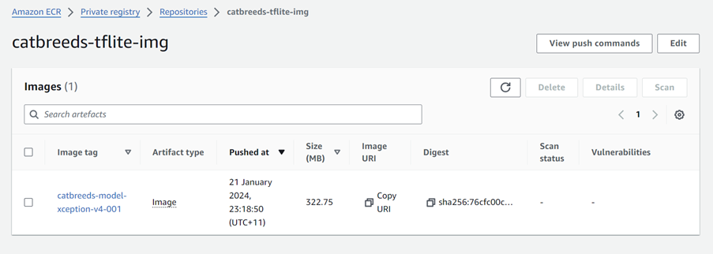
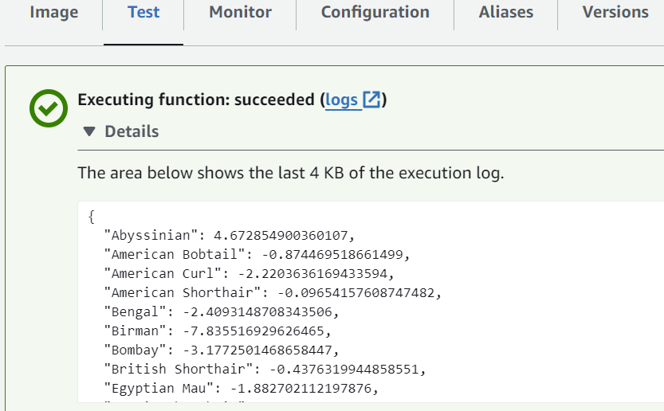
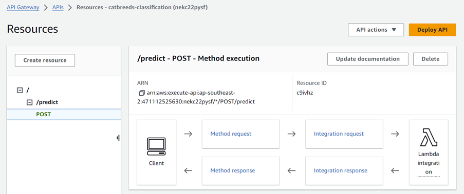
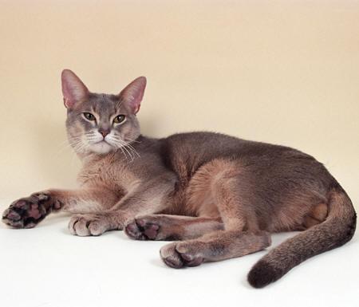
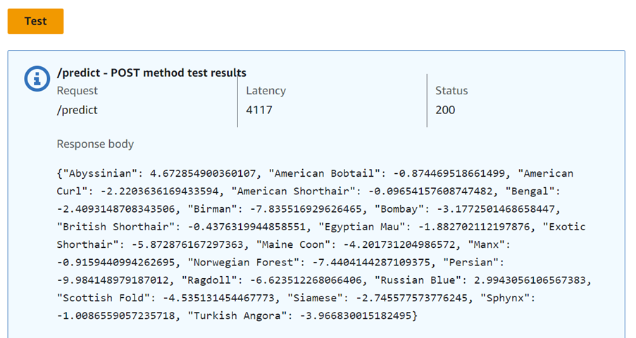
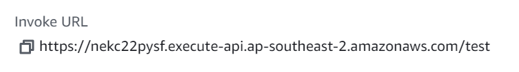
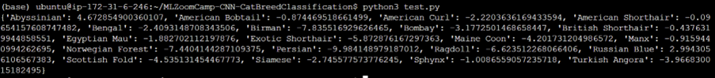

# **Model Deployment to AWS Lambda and API Gateway**

### 1. Create ECR registry on AWS

Run the following commands:

```
pip install awscli
```

```
aws ecr create-repository --repository-name catbreeds-tflite-img
```

```
$(aws ecr get-login --no-include-email)
```

This will create a URI of the frorm: 471112525630.dkr.ecr.ap-southeast-2.amazonaws.com/catbreeds-tflite-img

### 2. Register image in public ECR

Give URI of the form: 471112525630.dkr.ecr.ap-southeast-2.amazonaws.com/catbreeds-tflite-img, define the following: variables

ACCOUNT=471112525630

REGION=ap-southeast-2

REGISTRY=catbreeds-tflite-img

PREFIX=\${ACCOUNT}.dkr.ecr.\${REGION}.amazonaws.com/\${REGISTRY}

TAG=catbreeds-model-xception-v4-001

REMOTE_URI=\${PREFIX}:\${TAG}

The above will need to be modified depending on the URI created by Step 1. above

To allow the following commands to be run:

```
docker tag catbreeds-model ${REMOTE_URI}
```

```
docker push ${REMOTE_URI}
```

<u>Docker container in AWS</u>



<u>Executing Lambda function</u>


<u>Using API Gateway</u>



url set to: https://raw.githubusercontent.com/BuzzKanga/MLZoomCamp-CNN-CatBreedClassification/master/Abyssinian_104.jpg





<u>Deploy</u>



<u>Response from Gateway</u>


